# KatchX3 Core Service

[](https://nodejs.org/)
[](https://expressjs.com/)
[](https://postgresql.org/)
[](https://sequelize.org/)

A modular REST API service built with Node.js, Express, and PostgreSQL using a dependency injection architecture and custom logging system.

## 🏗️ Architecture Overview

```mermaid
graph TB
    %% Entry Point
    Main[main.js] --> Container[DI Container]

    %% Core Infrastructure
    Container --> CustomLogger[Custom Logger<br/>7 Levels + Colors]
    Container --> DB[Database Config]
    Container --> App[Express App Factory]

    %% Database Layer
    DB --> Sequelize[(Sequelize ORM)]
    Sequelize --> Models[Data Models]
    Models --> UserModel[User Model]
    Models --> OrderModel[Order Model]
    Models --> ModelRelationships[Model Relationships<br/>User hasMany Orders]

    %% Module System
    Container --> ModuleRegistry[Module Registry]
    ModuleRegistry --> UserModule[User Module]
    ModuleRegistry --> OrderModule[Order Module]

    %% User Module Components
    UserModule --> UserConfig[User Config<br/>Schema Definition]
    UserModule --> UserService[User Service<br/>BaseService + CRUD]
    UserModule --> UserController[User Controller<br/>BaseController + Routes]
    UserModule --> UserModel

    %% Order Module Components
    OrderModule --> OrderConfig[Order Config<br/>Schema Definition]
    OrderModule --> OrderService[Order Service<br/>BaseService + CRUD]
    OrderModule --> OrderController[Order Controller<br/>BaseController + Routes]
    OrderModule --> OrderModel

    %% HTTP Layer
    App --> Routes[Route Handlers]
    Routes --> UserController
    Routes --> OrderController
    App --> Morgan[Morgan HTTP Logging<br/>Custom Format]

    %% Utilities & Helpers
    Container --> APIResponse[API Response Helper<br/>Envelope Pattern]
    Container --> BuildOptions[Query Builder<br/>Pagination/Sorting/Filtering]

    %% Base Classes
    UserService --> BaseService[Base Service<br/>CRUD Operations]
    UserController --> BaseController[Base Controller<br/>HTTP Handlers]
    UserModule --> BaseModule[Base Module<br/>DI Integration]
    UserConfig --> BaseConfig[Base Module Config<br/>Schema + Naming]

    %% External Dependencies
    Sequelize --> PostgresDB[(PostgreSQL Database)]
    CustomLogger --> Chalk[Chalk Colors + Icons]
    App --> Express[Express 5.x]

    %% Error Handling
    Main --> GlobalHandlers[Global Error Handlers<br/>Process Events]

    %% Styling
    classDef coreInfra fill:#e1f5fe
    classDef moduleSystem fill:#f3e5f5
    classDef dataLayer fill:#e8f5e8
    classDef httpLayer fill:#fff3e0
    classDef utilities fill:#fce4ec
    classDef baseClasses fill:#f0f4c3

    class Main,Container,CustomLogger,DB,App,GlobalHandlers coreInfra
    class ModuleRegistry,UserModule,OrderModule moduleSystem
    class Sequelize,Models,UserModel,OrderModel,ModelRelationships,PostgresDB dataLayer
    class Routes,UserController,OrderController,Morgan,Express httpLayer
    class APIResponse,BuildOptions,Chalk utilities
    class BaseService,BaseController,BaseModule,BaseConfig baseClasses
```



## 🚀 Quick Start

### Prerequisites

- Node.js 20.x or higher
- PostgreSQL 12+
- npm or yarn

### Installation

```bash
# Clone repository
git clone <repository-url>
cd katchx3-core-service

# Install dependencies
npm install

# Setup environment
cp .env.example .env
# Edit .env with your database credentials

# Start development server
npm run dev

# Or start production server
npm start
```

### Environment Variables

```bash
# Application
NODE_ENV=development
LOG_LEVEL=debug
PORT=3000
BASE_URL=http://localhost

# Database
DB_HOST=localhost
DB_PORT=5432
DB_USER=katchx_user
DB_PASSWORD=katchx123
DB_NAME=katchx_core
DB_DIALECT=postgres
DB_SYNC_ALTER=true
```

## 📁 Project Structure

```
src/
├── main.js                    # Application bootstrap with DI & error handlers
├── app.js                     # Express app factory with middleware
├── config/
│   └── database.js           # Sequelize configuration & utilities
├── common/
│   ├── helper/
│   │   ├── logger.js         # Custom logger with 7 levels & chalk colors
│   │   ├── di-container.js   # Enhanced DI container with caching
│   │   ├── api.response.js   # Standardized API response envelope
│   │   └── buildOptions.js   # Query builder (pagination/sorting/filtering)
│   ├── interface/
│   │   ├── base.config.js    # Base module configuration class
│   │   ├── base.model.js     # Base model interface
│   │   ├── base.module.js    # Base module with DI integration
│   │   ├── base.route.js     # Base route interface
│   │   └── base.service.js   # Base service with CRUD operations
│   └── middleware/           # Custom middleware (future)
├── modules/
│   ├── allModules.js         # Module registry function
│   ├── model.relationship.js # Sequelize model relationships
│   ├── user/
│   │   ├── user.config.js    # User schema & module configuration
│   │   ├── user.model.js     # User Sequelize model definition
│   │   ├── user.service.js   # User business logic (extends BaseService)
│   │   ├── user.controller.js # User HTTP handlers (extends BaseController)
│   │   └── user.module.js    # User module orchestrator
│   └── order/
│       ├── order.config.js   # Order schema & module configuration
│       ├── order.model.js    # Order Sequelize model definition
│       ├── order.service.js  # Order business logic (extends BaseService)
│       ├── order.controller.js # Order HTTP handlers (extends BaseController)
│       └── order.module.js   # Order module orchestrator
├── test/
│   └── health.test.js        # Health check test
└── postman/                  # API testing collections
    ├── KatchX3-API.postman_collection.json
    ├── KatchX3-Development.postman_environment.json
    └── KatchX3-User-API.postman_collection.json
```

## 🔧 Core Components

### Custom Logger System

Advanced logging with 7 custom levels, visual colors, and HTTP integration:

```javascript
// Available log levels with colors and icons
const levels = {
    fatal: 0, // ☠️  Red bold on white
    error: 1, // ❌  Red
    warn: 2, // ⚠️  Yellow
    info: 3, // ℹ️  Cyan
    executeAPI: 4, // 🛜  Blue (API start)
    runService: 5, // 🛠️  Magenta (service calls)
    returnAPI: 6, // ↩️  Green (API response)
    debug: 7, // 🔍  Gray
};

// Usage examples
logger.executeAPI('➡️ POST /users ✅ Started');
logger.runService('Creating user with validation');
logger.returnAPI('✅ User created successfully');
logger.error('Validation failed', { errors: ['Email required'] });
```

### Enhanced Dependency Injection Container

Robust DI system with caching, validation, and multiple registration patterns:

```javascript
// Registration patterns
container.registerClass('logger', Logger); // Class constructor
container.registerFactory('sequelize', db.createSequelize); // Factory function
container.register('config', configObject); // Direct object

// Dependency resolution with caching
const logger = container.get('logger'); // Cached singleton
const service = container.getWithArgs('userService', config); // With arguments

// Enhanced error handling
const dep = container.get('nonExistent'); // Throws with available keys list
```

### Modular Architecture

Self-contained modules following consistent patterns:

```javascript
// Module structure with BaseModule inheritance
class UserModule extends BaseModule {
    constructor() {
        super(defineModel, UserService, UserController, userConfig);
        // Automatic DI registration:
        // - userService -> UserService class
        // - userController -> UserController class
    }

    initApp(app) {
        // 1. Define Sequelize model with schema
        // 2. Attach controller routes to Express app
        // 3. Module ready for HTTP requests
    }
}

// Configuration-driven approach
const userConfig = new BaseModuleConfig({
    singularizedName: 'user',
    pluralizedName: 'users',
    modelName: 'user',
    tableName: 'users',
    serviceName: 'userService',
    controllerName: 'userController',
    basePath: '/users',
    schema: { username: {...}, email: {...} }
});
```

### Standardized API Responses

All endpoints return consistent response format:

```javascript
// Success response
{
    "success": true,
    "data": {...},
    "meta": {...},
    "message": "Operation completed"
}

// Error response
{
    "success": false,
    "data": null,
    "error": "Error details",
    "message": "Operation failed"
}
```

## 🛠️ API Endpoints

### Health Check

- `GET /health` - Service health status

### User Management

- `GET /users` - List users with pagination/filtering/sorting
- `GET /users/:id` - Get user by ID
- `POST /users` - Create new user
- `PUT /users/:id` - Update user
- `DELETE /users/:id` - Delete user

### Order Management

- `GET /orders` - List orders with pagination/filtering/sorting
- `GET /orders/:id` - Get order by ID
- `POST /orders` - Create new order
- `PUT /orders/:id` - Update order
- `DELETE /orders/:id` - Delete order

### Advanced Query Parameters

Support for flexible querying with buildOptions helper:

```bash
# Pagination
GET /users?page=1&pageSize=10

# Sorting (multiple fields, DESC with -)
GET /users?sort=fullName,-createdAt,age

# Field selection
GET /users?fields=id,username,email,fullName

# Filtering (exact match)
GET /users?username=john&isActive=true
GET /orders?status=pending&isPaid=false

# Combined querying
GET /users?page=2&pageSize=5&sort=-age&fields=username,fullName&isActive=true
```

## 🧪 Testing & API Documentation

### Available Test Scripts

```bash
# Run health check test
npm test

# Run specific test file
npm run test:health

# Lint code
npm run lint
npm run lint:fix      # Auto-fix ESLint issues

# Format code
npm run format
npm run format:fix    # Auto-format with Prettier
```

### Postman Collections

Comprehensive API testing collections included:

- **`KatchX3-API.postman_collection.json`** - Complete API suite
    - Health check endpoints
    - User CRUD operations with validation scenarios
    - Order CRUD operations with business logic tests
    - Error handling and edge cases
    - Pagination, sorting, and filtering examples

- **`KatchX3-Development.postman_environment.json`** - Environment variables
    - Base URL configuration
    - Authentication tokens (future)
    - Test data variables

- **`KatchX3-User-API.postman_collection.json`** - User-specific tests
    - User registration and profile management
    - Email validation scenarios
    - Username uniqueness tests

### Test Categories

1. **Health & Connectivity**
    - Service availability
    - Database connection status

2. **User Management**
    - Registration with validation
    - Profile updates and data integrity
    - Duplicate username/email handling

3. **Order Processing**
    - Order creation and status management
    - Payment status tracking
    - User-order relationship validation

4. **Query Operations**
    - Pagination boundary conditions
    - Complex sorting scenarios
    - Field filtering accuracy

5. **Error Scenarios**
    - Invalid data submissions
    - Missing required fields
    - Database constraint violations

## 📊 Data Models & Relationships

### User Model

```javascript
{
    id: Integer(Primary Key, Auto Increment);
    username: String(unique, required);
    email: String(unique, required, email validation);
    password: String(required);
    phone: String(optional);
    fullName: String(optional);
    age: Integer(optional);
    isActive: Boolean(default: true);
    createdAt: DateTime(auto);
    updatedAt: DateTime(auto);
}
```

### Order Model

```javascript
{
    id: Integer(Primary Key, Auto Increment);
    orderNumber: String(unique, required);
    userId: Integer(Foreign Key -> User.id);
    totalAmount: Decimal(10,2, required);
    status: String(required, default: 'pending');
    isPaid: Boolean(default: false);
    paidAt: DateTime(optional);
    createdAt: DateTime(auto);
    updatedAt: DateTime(auto);
}
```

### Model Relationships

Defined in `src/modules/model.relationship.js` and integrated in main.js:

```javascript
// User hasMany Orders
user.hasMany(order, { foreignKey: 'userId', as: 'orders' });

// Order belongsTo User
order.belongsTo(user, { foreignKey: 'userId', as: 'user' });

// Usage in queries
const userWithOrders = await User.findOne({
    include: [{ model: Order, as: 'orders' }],
});

const orderWithUser = await Order.findOne({
    include: [{ model: User, as: 'user' }],
});
```

## 🔍 Component Relationships

### Application Bootstrap Flow

1. **main.js** → DI Container Registration
    - `registerClass('logger', Logger)` → Custom logger instance
    - `registerFactory('sequelize', db.createSequelize)` → Database connection
    - `registerFactory('allModules', registerAllModules)` → Module instances
    - `registerFactory('app', createApp)` → Express application

2. **Module Registration** → BaseModule Integration
    - Each module registers its Service and Controller in DI
    - BaseModule constructor handles dependency wiring
    - Module.initApp() defines models and attaches routes

3. **Model Relationships** → Sequelize Associations
    - `defineRelationships(sequelize)` called after modules
    - User-Order relationships established before DB sync

4. **HTTP Request Flow**
    ```
    Express Request → Router → Controller → Service → Model → Database
    Database Response → Model → Service → Controller → API Envelope → Client
    ```

### Dependency Chain & Error Handling

```
main.js (Global error handlers)
├── DI Container (Enhanced validation & caching)
├── Custom Logger (7 levels, colors, HTTP stream)
├── Database (Connection pooling, error context)
├── Express App (Morgan logging, JSON parsing)
└── Modules (BaseModule pattern)
    ├── User Module
    │   ├── UserConfig (Schema + naming conventions)
    │   ├── UserModel (Sequelize definition)
    │   ├── UserService (BaseService + business logic)
    │   └── UserController (BaseController + HTTP handling)
    └── Order Module
        ├── OrderConfig (Schema + naming conventions)
        ├── OrderModel (Sequelize definition)
        ├── OrderService (BaseService + business logic)
        └── OrderController (BaseController + HTTP handling)
```

### Key Design Patterns

- **Dependency Injection**: Centralized service management with caching
- **Base Classes**: Consistent CRUD operations and HTTP handling
- **Configuration-Driven**: Schema and routing from module config
- **Envelope Pattern**: Standardized API responses with success/error states
- **Factory Pattern**: Dynamic instance creation with validation

## 🚦 Development Guidelines

### Code Style & Standards

- **ES6+ Modules**: Import/export with `.js` extensions required
- **Async/Await**: All asynchronous operations use async/await pattern
- **Class-Based Architecture**: BaseModule, BaseService, BaseController inheritance
- **Dependency Injection**: All services registered and resolved via DI container
- **Configuration-Driven**: Module schemas and settings via config classes
- **Consistent Naming**: Singular/plural conventions, service/controller suffixes

### Logging & Debugging

```javascript
// Use appropriate log levels for different scenarios
logger.executeAPI('➡️ POST /users ✅ Started'); // API entry points
logger.runService('Validating user data'); // Service operations
logger.returnAPI('✅ User created successfully'); // API responses
logger.error('Validation failed', { field: 'email' }); // Errors with context
logger.debug('Processing step 3 of 5'); // Detailed debugging
```

### Error Handling Patterns

- **Global Handlers**: Process-level unhandled rejection/exception handling
- **Try-Catch Blocks**: All async operations wrapped with detailed error context
- **API Envelopes**: Standardized error responses with success flag
- **Validation Errors**: Clear field-level error messages
- **Database Errors**: Connection context and operation details

### Module Development

```javascript
// 1. Create module config with schema
const moduleConfig = new BaseModuleConfig({
    singularizedName: 'product',
    pluralizedName: 'products',
    schema: { name: { type: DataTypes.STRING, allowNull: false } },
});

// 2. Extend base classes
class ProductService extends BaseService {
    /* custom logic */
}
class ProductController extends BaseController {
    /* custom endpoints */
}

// 3. Create module with inheritance
class ProductModule extends BaseModule {
    constructor() {
        super(defineModel, ProductService, ProductController, moduleConfig);
    }
}

// 4. Register in allModules.js
allModules.push(new ProductModule());
```

## 📝 Available Scripts

```bash
# Development
npm run dev           # Development server with nodemon auto-reload
npm start            # Production server

# Code Quality
npm run lint         # ESLint code analysis
npm run lint:fix     # Auto-fix ESLint issues
npm run format       # Prettier formatting check
npm run format:fix   # Auto-format code with Prettier

# Testing
npm test            # Run all tests
npm run test:health # Run health check tests specifically

# Module Generation (Future)
npm run gen:module  # Generate new module boilerplate
```

## 🚀 Deployment & Environment Setup

### Development Environment

```bash
# Clone and setup
git clone <repository-url>
cd katchx3-core-service
npm install

# Environment configuration
cp .env.example .env
# Edit .env with your database credentials

# Database setup
# 1. Create PostgreSQL database
# 2. Configure DB_* variables in .env
# 3. Run application (auto-sync enabled in development)

# Start development
npm run dev
```

### Production Deployment

```bash
# Production environment variables
NODE_ENV=production
LOG_LEVEL=info
DB_SYNC_ALTER=false          # Disable auto-migration
PORT=3000
BASE_URL=https://api.yourdom.ain

# Database (production values)
DB_HOST=prod-postgres-host
DB_PORT=5432
DB_USER=katchx_prod_user
DB_PASSWORD=secure_password
DB_NAME=katchx_core_prod
DB_POOL_MAX=20
DB_POOL_MIN=5
```

### Production Checklist

- [ ] Set `NODE_ENV=production`
- [ ] Configure production PostgreSQL database
- [ ] Set appropriate `LOG_LEVEL` (info/warn/error)
- [ ] Disable `DB_SYNC_ALTER` and use proper migrations
- [ ] Configure reverse proxy (nginx/Apache)
- [ ] Set up SSL/TLS certificates
- [ ] Configure monitoring and health checks
- [ ] Set up log aggregation and rotation
- [ ] Configure database backups
- [ ] Set resource limits and scaling policies

## 🔐 Security & Performance Considerations

### Security Features

- **Environment-Based Configuration**: Sensitive credentials via .env files
- **Input Validation**: Sequelize schema validation and type checking
- **SQL Injection Protection**: Sequelize ORM with parameterized queries
- **Request Logging**: Comprehensive audit trails with Morgan + custom logger
- **Error Information Leakage**: Structured error responses without stack traces in production

### Performance Optimizations

- **Database Connection Pooling**: Configurable min/max connections
- **Instance Caching**: DI container caches resolved dependencies
- **Selective Field Loading**: Query parameter `fields` for response optimization
- **Pagination Support**: Built-in limit/offset with page-based navigation
- **Lazy Loading**: Modules and services instantiated on-demand

### Production Readiness

```javascript
// Environment variables for production tuning
DB_POOL_MAX = 20; // Maximum database connections
DB_POOL_MIN = 5; // Minimum idle connections
DB_POOL_ACQUIRE = 30000; // Connection acquisition timeout
DB_POOL_IDLE = 10000; // Idle connection timeout
LOG_LEVEL = info; // Production log level
DB_SYNC_ALTER = false; // Disable auto-migration in production
```

### Monitoring & Observability

- **HTTP Request Logging**: Method, URL, status, response time
- **Database Operations**: Connection status, query performance
- **Error Tracking**: Unhandled exceptions with process details
- **Health Endpoints**: Service availability monitoring
- **Custom Log Levels**: Fine-grained debugging and API tracing

## 🚀 Deployment

### Environment Setup

1. Set production environment variables
2. Configure PostgreSQL database
3. Run database migrations/sync
4. Start application server

### Production Checklist

- [ ] Set `NODE_ENV=production`
- [ ] Configure production database
- [ ] Set appropriate log levels
- [ ] Enable database migrations instead of sync
- [ ] Configure reverse proxy (nginx)
- [ ] Set up monitoring and health checks

## 🤝 Contributing

1. Fork the repository
2. Create feature branch
3. Follow coding standards
4. Add tests for new features
5. Submit pull request

## 📄 License

ISC License - see LICENSE file for details.

---

**Version:** 1.0.0  
**Node.js:** 20.x+  
**Database:** PostgreSQL with Sequelize ORM  
**Architecture:** Modular REST API with Enhanced DI, Custom Logging & Base Class Inheritance  
**Current Modules:** User Management, Order Processing  
**Testing:** Postman Collections + Health Check Tests  
**Features:** Advanced querying, model relationships, colored logging, error handling
