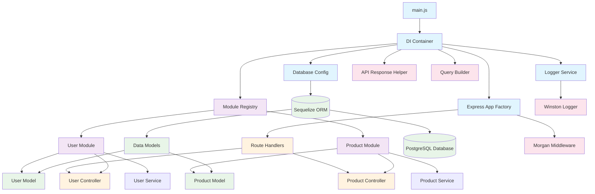

# KatchX3 Core Service

[](https://nodejs.org/)
[](https://expressjs.com/)
[](https://postgresql.org/)
[](https://sequelize.org/)

A modular REST API service built with Node.js, Express, and PostgreSQL using a dependency injection architecture.

## 🏗️ Architecture Overview



## 🚀 Quick Start

### Prerequisites

- Node.js 20.x or higher
- PostgreSQL 12+
- npm or yarn

### Installation

```bash
# Clone repository
git clone <repository-url>
cd katchx3-core-service

# Install dependencies
npm install

# Setup environment
cp .env.example .env
# Edit .env with your database credentials

# Start development server
npm run dev

# Or start production server
npm start
```

### Environment Variables

```bash
# Application
NODE_ENV=development
LOG_LEVEL=debug
PORT=3000
BASE_URL=http://localhost

# Database
DB_HOST=localhost
DB_PORT=5432
DB_USER=katchx_user
DB_PASSWORD=katchx123
DB_NAME=katchx_core
DB_DIALECT=postgres
DB_SYNC_ALTER=true
```

## 📁 Project Structure

```
src/
├── main.js                    # Application entry point
├── app.js                     # Express app factory
├── config/
│   └── database.js           # Database configuration
├── common/
│   ├── logger.js             # Legacy logger (deprecated)
│   ├── helper/
│   │   ├── logger.js         # Winston logger implementation
│   │   ├── di-container.js   # Dependency injection container
│   │   ├── api.response.js   # Standardized API responses
│   │   └── buildOptions.js   # Query parameter builder
│   ├── interface/
│   │   ├── base.model.js     # Base model configuration
│   │   ├── base.module.js    # Base module interface
│   │   ├── base.route.js     # Base route interface
│   │   └── base.service.js   # Base service interface
│   └── middleware/           # Custom middleware (future)
├── modules/
│   ├── allModules.js         # Module registry
│   ├── user/
│   │   ├── user.model.js     # User data model
│   │   ├── user.service.js   # User business logic
│   │   ├── user.controller.js # User HTTP handlers
│   │   └── user.module.js    # User module orchestrator
│   └── product/
│       ├── product.model.js  # Product data model
│       ├── product.service.js # Product business logic
│       ├── product.controller.js # Product HTTP handlers
│       └── product.module.js # Product module orchestrator
└── test/
    └── health.test.js        # Health check test
```

## 🔧 Core Components

### Dependency Injection Container

The DI container manages service dependencies and lifecycle:

```javascript
// Register services
container.register('logger', () => new Logger());
container.registerFactory('sequelize', () => db.createSequelize());
container.register('userService', () => new UserService());

// Resolve dependencies
const logger = container.get('logger');
const sequelize = container.get('sequelize');
```

### Modular Architecture

Each feature is organized as a self-contained module:

```javascript
class UserModule {
    constructor() {
        // Register module services in DI
        container.register('userService', () => new UserService());
        container.register('userController', () => new UserController());
    }

    initApp(app) {
        // Define models and attach routes
        defineUserModel(this.sequelize);
        this.userController.attachRoutes(app);
    }
}
```

### Standardized API Responses

All endpoints return consistent response format:

```javascript
// Success response
{
    "success": true,
    "data": {...},
    "meta": {...},
    "message": "Operation completed"
}

// Error response
{
    "success": false,
    "data": null,
    "error": "Error details",
    "message": "Operation failed"
}
```

## 🛠️ API Endpoints

### Health Check

- `GET /health` - Service health status

### User Management

- `GET /users` - List users with pagination/filtering
- `GET /users/:id` - Get user by ID
- `POST /users` - Create new user
- `PUT /users/:id` - Update user
- `DELETE /users/:id` - Delete user

### Query Parameters

Support for flexible querying:

```bash
# Pagination
GET /users?page=1&pageSize=10

# Sorting
GET /users?sort=name,-createdAt

# Filtering
GET /users?username=john&email=john@example.com

# Field selection
GET /users?fields=id,username,email
```

## 🧪 Testing

```bash
# Run health check test
npm test

# Run specific test
npm run test:health

# Lint code
npm run lint

# Format code
npm run format
```

## 📊 Data Models

### User Model

```javascript
{
    username: String(unique, required);
    email: String(unique, required);
    password: String(required);
    phone: String(optional);
    fullName: String(optional);
    createdAt: DateTime;
    updatedAt: DateTime;
}
```

### Product Model

```javascript
{
    name: String(required);
    createdAt: DateTime;
    updatedAt: DateTime;
}
```

## 🔍 Component Relationships

### Data Flow

1. **HTTP Request** → Express App
2. **Route Handler** → Controller
3. **Controller** → Service (business logic)
4. **Service** → Model (data access)
5. **Model** → Database via Sequelize
6. **Response** ← Standardized API format

### Dependency Chain

```
main.js
├── DI Container
├── Database (Sequelize)
├── Logger (Winston)
├── Express App
└── Modules
    ├── User Module
    │   ├── User Model
    │   ├── User Service
    │   └── User Controller
    └── Product Module
        ├── Product Model
        ├── Product Service
        └── Product Controller
```

## 🚦 Development Guidelines

### Code Style

- ES6+ modules
- Async/await for asynchronous operations
- Class-based architecture
- Dependency injection pattern

### Error Handling

- Structured logging with Winston
- Standardized error responses
- Try-catch blocks in all async operations

### Performance

- Connection pooling for database
- Request logging with Morgan
- Environment-based configurations

## 📝 Scripts

```bash
npm start          # Production server
npm run dev        # Development with nodemon
npm run lint       # ESLint check
npm run lint:fix   # Auto-fix lint issues
npm run format     # Prettier check
npm run format:fix # Auto-format code
npm test          # Run tests
```

## 🔐 Security Considerations

- Environment-based configuration
- Input validation (to be implemented)
- SQL injection protection via Sequelize
- Request logging for audit trails

## 🚀 Deployment

### Environment Setup

1. Set production environment variables
2. Configure PostgreSQL database
3. Run database migrations/sync
4. Start application server

### Production Checklist

- [ ] Set `NODE_ENV=production`
- [ ] Configure production database
- [ ] Set appropriate log levels
- [ ] Enable database migrations instead of sync
- [ ] Configure reverse proxy (nginx)
- [ ] Set up monitoring and health checks

## 🤝 Contributing

1. Fork the repository
2. Create feature branch
3. Follow coding standards
4. Add tests for new features
5. Submit pull request

## 📄 License

ISC License - see LICENSE file for details.

---

**Version:** 1.0.0  
**Node.js:** 20.x+  
**Database:** PostgreSQL  
**Architecture:** Modular REST API with Dependency Injection
